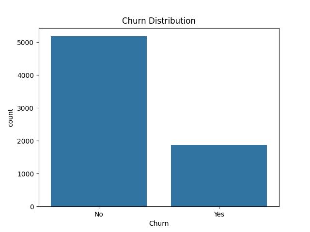
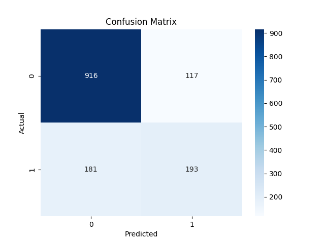
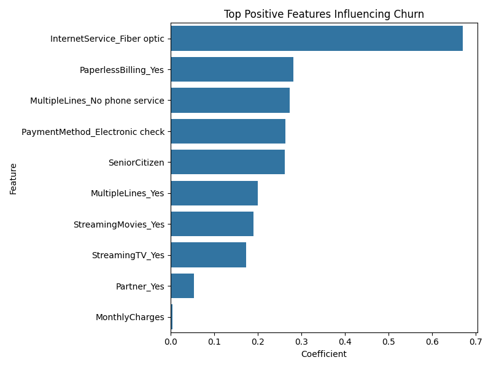

# Customer Churn Prediction with Logistic Regression
  
**Tools Used:** Python, Pandas, Seaborn, Scikit-learn, Matplotlib  

> This project analyzes customer churn behavior using the Telco Customer Churn dataset. A logistic regression model is built to predict churn probability, enabling businesses to proactively reduce attrition.

---

## Table of Contents

- [Overview](#overview)
- [Real-World Use Cases](#real-world-use-cases)
- [Features](#features)
- [Steps Performed](#steps-performed)
- [Outcomes](#outcomes)
- [Next Steps](#next-steps)
- [Installation](#installation)
- [Usage](#usage)
- [Contributing](#contributing)
- [License](#license)

---

## 🔍 Overview

Churn refers to the rate at which customers stop doing business with a company. This project applies logistic regression to identify key risk factors and predict churn, using structured telco service data.

---

## Real-World Use Cases

- **Telecom companies** identifying high-risk customers and intervening with retention offers  
- **SaaS businesses** predicting subscription cancellations based on usage behavior  
- **Marketing teams** designing targeted loyalty programs for churn-prone segments  
- **Product managers** aligning roadmap decisions with user pain points linked to attrition  

---

## Features

- Cleaned and preprocessed real-world telecom churn data  
- Visualized churn patterns and class imbalance  
- Trained and evaluated a logistic regression classifier  
- Identified top drivers of churn via model coefficients  
- Produced publishable-quality plots for presentations

---

## Steps Performed

### 1. Data Loading & Cleaning
- Loaded the Telco churn dataset using Pandas.
- Dropped the `customerID` column and handled missing values in `TotalCharges` by converting to numeric and dropping nulls.

### 2. Exploratory Data Analysis (EDA)
- Visualized the churn distribution using `sns.countplot`.
- Noted class imbalance with more customers not churning.

### 3. Feature Engineering
- Converted categorical variables to numerical using one-hot encoding (`pd.get_dummies`).
- Dropped one category per feature to avoid multicollinearity.

### 4. Model Development
- Defined features (`X`) and target (`y`), where churned customers were encoded as `1`.
- Split data into training and testing sets (80/20 split).
- Trained a logistic regression model with `max_iter=600`.

### 5. Model Evaluation
- Evaluated using accuracy, confusion matrix, and classification report.
- Accuracy score printed to assess overall performance.

### 6. Feature Importance
- Extracted and plotted top positive coefficients from the logistic regression model.
- Identified key features contributing to churn risk (e.g., contract type, tenure, monthly charges).

---

## Outcomes

- Built a baseline churn classification model using logistic regression.
- Achieved interpretable results highlighting key churn indicators.
- Gained insights into which service factors are most correlated with customer attrition.

---

## Next Steps

- Experiment with advanced models (Random Forest, XGBoost).
- Address class imbalance using SMOTE or class weights.
- Deploy the model using Flask or Streamlit for business use.

## Installation

Clone the repository and install required dependencies

## Usage

Run the analysis on VS Code or Jupyter NoteBook

## Contributing

We welcome community contributions!

1. Fork the repository

2. Create a new branch:

git checkout -b feature/your-feature

3. Make your changes

4. Push to your branch:

git push origin feature/your-feature

5. Submit a Pull Request

## License
This project is licensed under the MIT License.
